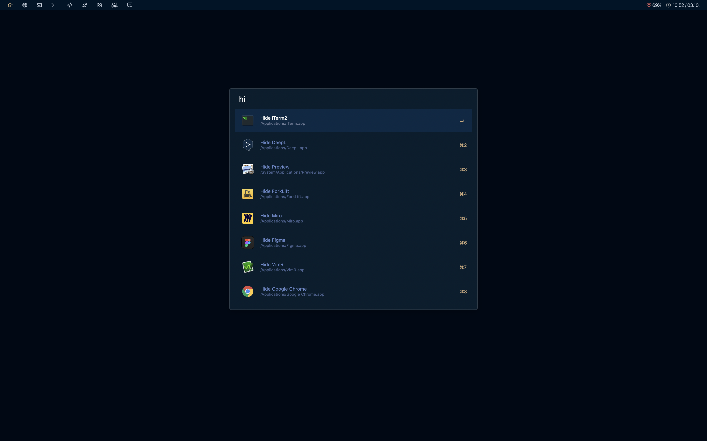
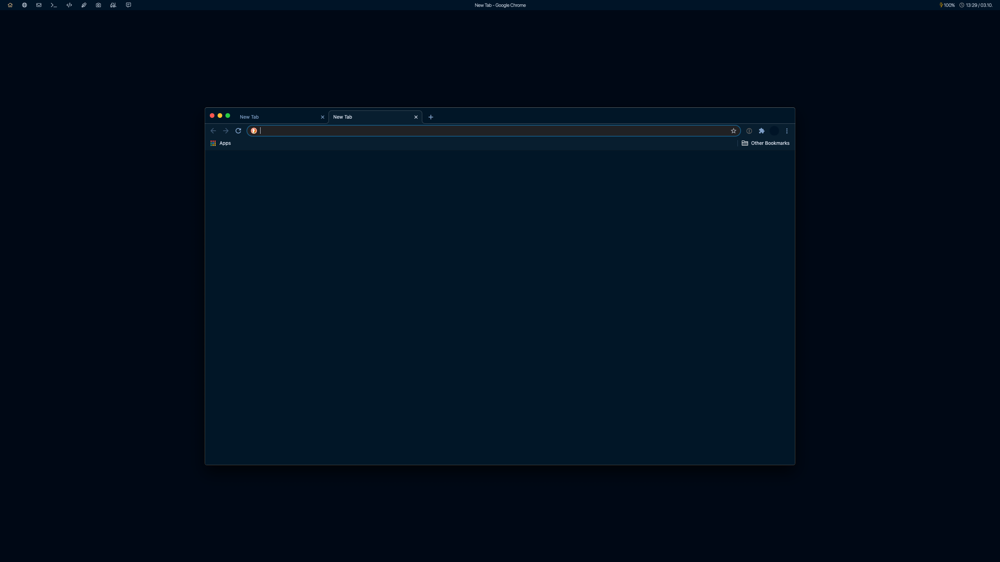
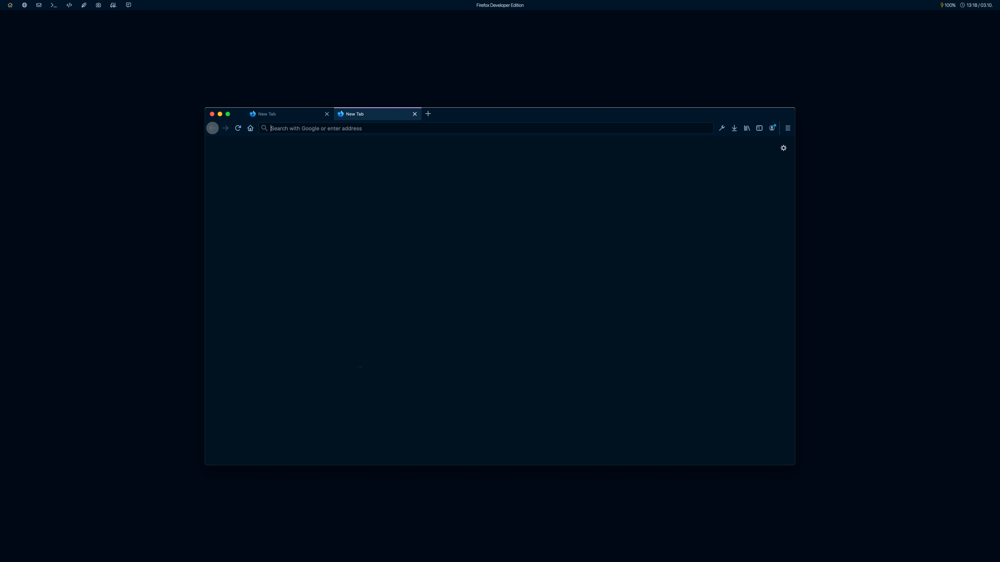
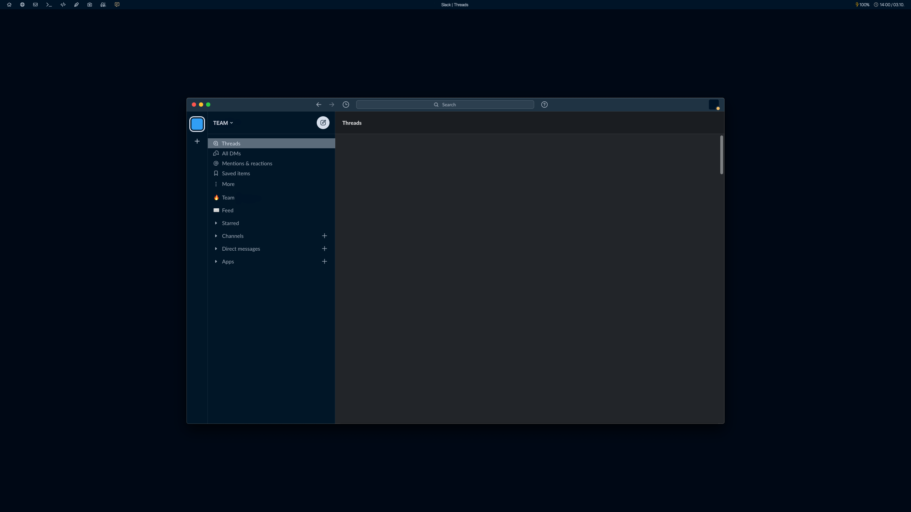
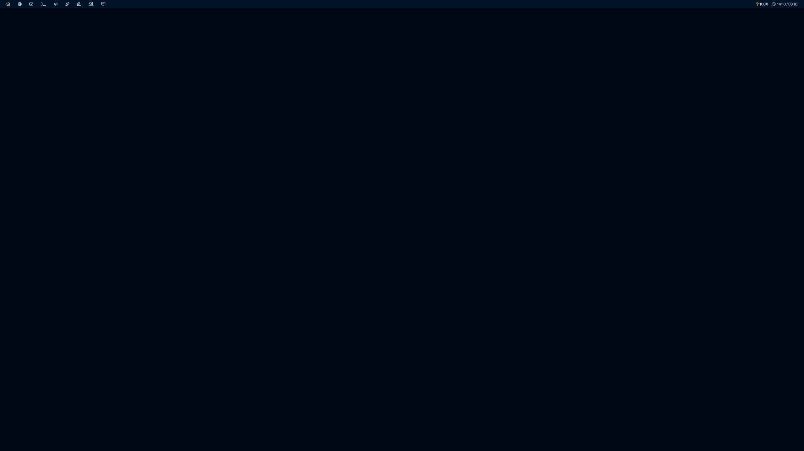
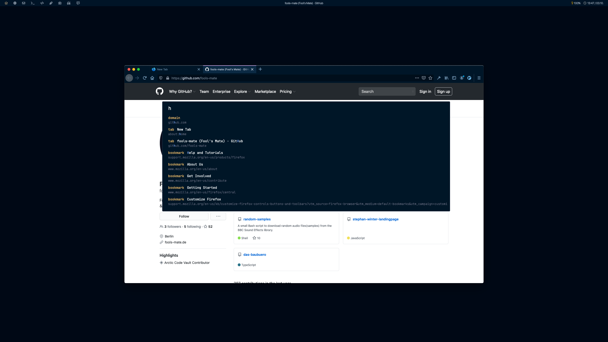

# Collection of Night Owl Themes

This is a bunch of ports made by me for different tools based on the popular [Night Owl theme by Sarah Drasner](https://github.com/sdras/night-owl-vscode-theme).

## Themes for the following tools:
[Alfred](https://www.alfredapp.com)

[Chrome](https://www.google.com/chrome)

[Firefox](https://www.mozilla.org/en-US/firefox/new)

[Slack](https://slack.com)

[Spacebar](https://github.com/cmacrae/spacebar)

[Vimium](https://github.com/philc/vimium)

## Installation:

In each folder there is a quick guide to install the theme for the selected tool.

## Note:

I hope this is helpful for someone who wants to style everything around this theme, just like me. 🙂

If you want to have a quick solution for another theme, check out: ***[themer](https://github.com/mjswensen/themer)***!
